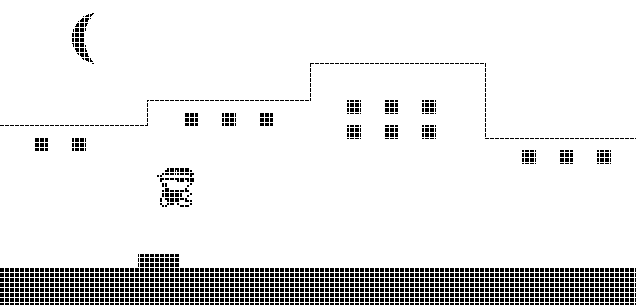

# From Nand to Tetris
## About this repo
I completed the *Build a Modern Computer from First Principles: Nand to Tetris Part I and Part II * from [Coursera](https://www.coursera.org).

The **projects 1 - 6** are from the part I of the course. I used python to write the Hack assembler (week 6 assignment).

The **projects 7 - 12** are from the part II of the course. As in the part I, I used python to write the Jack compiler, VM translator and Jack analyzer.

**Project 9** is a basic runner game (similar to Google's Trex run) that I wrote in the Jack language (peer reviewed project)

[Build a Modern Computer from First Principles: From Nand to Tetris](https://www.coursera.org/learn/build-a-computer)  
[Build a Modern Computer from First Principles: Nand to Tetris Part II](https://www.coursera.org/learn/nand2tetris2)
[Course official website](https://www.nand2tetris.org/)
